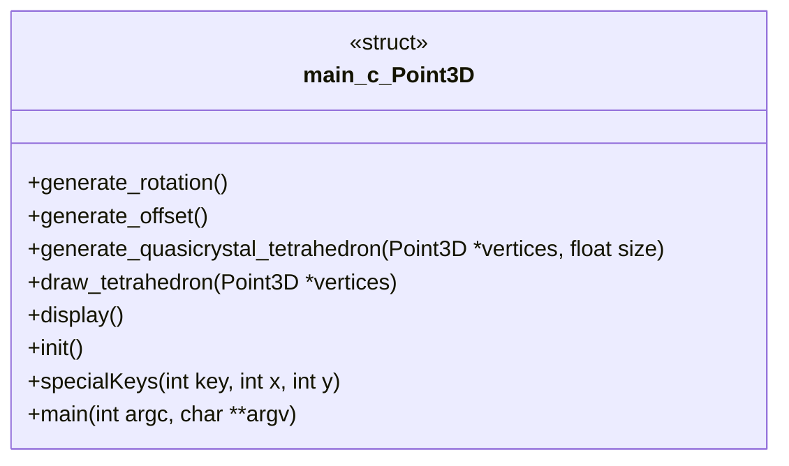

# Polyglot Codebase Knowledge Graph

> Generated offline by **readmenator**. 6 files, 33 symbols, 30 imports. Supports C, C++, Python, Go, Rust, JS/TS, Java, C#, Shell, PHP, Dart, GDScript, Nim, ASM, Ruby, Swift, Kotlin, Scala, Lua, Elixir.
> No LLMs. No tokens. Pure static analysis. See more [here](https://github.com/grisuno/ReadMenator)

**Start here:** Statistics Dashboard for scope, God Nodes for blast radius, Architecture Reference for per-file API. Agents: prefer `readmenator-agent/INDEX.md` + `SYMBOLS.md`.

**Wiki:** prefer `readmenator-wiki/index.md` for progressive disclosure: one synthesis page per community, `connections.json` with EXTRACTED vs INFERRED confidence, `queries.md` log, `REPORT.md` audit.

**Confidence:** EXTRACTED = parsed from source, INFERRED = heuristic bridge, AMBIGUOUS = reported, never hidden. See `readmenator-wiki/REPORT.md`.

**Total Files Parsed:** 6 | **Total Symbols Extracted:** 33 | **Total Imports:** 30

<!-- ranking_model: v1.0 | weights: {ppr:0.45,auth:0.2,test:0.15,doc:0.1,fresh:0.1} | alpha:0.85 | commit:05a4468 | date:2026-07-18 -->


## Table of Contents

1. [Statistics Dashboard](#statistics-dashboard)
2. [Architectural Layers](#architectural-layers)
3. [Ranked Context](#ranked-context)
4. [God Nodes](#god-nodes)
5. [Suggested Questions](#suggested-questions)
6. [Hotspot Analysis](#hotspot-analysis)
7. [Change Impact Analysis](#change-impact-analysis)
8. [Suggested Linting Rules](#suggested-linting-rules)
9. [Dataflow Analysis](#dataflow-analysis)
10. [Orphans](#orphans)
11. [Query Recipes](#query-recipes)
12. [Structural Knowledge Map](#structural-knowledge-map)
13. [UML Class Diagram](#uml-class-diagram)
14. [Code Property Graph](#code-property-graph)
15. [Architecture Reference](#architecture-reference)
    - [C (1 files)](#c-1-files)
    - [PY (5 files)](#py-5-files)

---

## Statistics Dashboard

| Metric | Value |
|--------|-------|
| Total Files | 6 |
| Total Symbols | 33 |
| Total Imports | 30 |
| Call Edges | 115 |
| Inheritance Edges | 0 |
| Languages | 2 |
| Avg Symbols/File | 5.5 |
| Avg Imports/File | 5.0 |

### Top Files by Import Count (Fan-Out)

| File | Imports | Symbols | Language |
|------|---------|---------|----------|
| `life.py` | 7 | 7 | py |
| `someideas2.py` | 7 | 5 | py |
| `main.c` | 4 | 11 | c |
| `main.py` | 4 | 2 | py |
| `someideas.py` | 4 | 5 | py |
| `transmision_qbits.py` | 4 | 3 | py |

---

## Architectural Layers

Auto-detected from path patterns, naming conventions, and imported frameworks.

| Layer | Files |
|-------|-------|
| utility | 6 |

### utility

- `life.py` (py, 7 symbols)
- `main.c` (c, 11 symbols)
- `main.py` (py, 2 symbols)
- `someideas.py` (py, 5 symbols)
- `someideas2.py` (py, 5 symbols)
- `transmision_qbits.py` (py, 3 symbols)

---

## Ranked Context

Files ranked by composite score for the current query context. The ranking combines Personalized PageRank (query relevance), global authority, test coverage, documentation coverage, and code freshness. Model: v1.0.

| Rank | File | Composite | PPR | Authority | Test | Doc |
|------|------|-----------|-----|-----------|------|-----|
| 1 | `life.py` | 0.1000 | 0.0000 | 0.0000 | 0.00 | 1.00 |
| 2 | `someideas.py` | 0.1000 | 0.0000 | 0.0000 | 0.00 | 1.00 |
| 3 | `someideas2.py` | 0.1000 | 0.0000 | 0.0000 | 0.00 | 1.00 |
| 4 | `transmision_qbits.py` | 0.0333 | 0.0000 | 0.0000 | 0.00 | 0.33 |
| 5 | `main.c` | 0.0091 | 0.0000 | 0.0000 | 0.00 | 0.09 |
| 6 | `main.py` | 0.0000 | 0.0000 | 0.0000 | 0.00 | 0.00 |

---

## God Nodes

Most architecturally central files ranked by combined import/export degree and symbol richness.

| File | Score | Connections | PageRank |
|------|-------|-------------|----------|
| `main.c` | 1.1 | | 0.0000 |
| `life.py` | 0.7 | | 0.0000 |
| `someideas.py` | 0.5 | | 0.0000 |
| `someideas2.py` | 0.5 | | 0.0000 |
| `transmision_qbits.py` | 0.3 | | 0.0000 |
| `main.py` | 0.2 | | 0.0000 |

---

## Suggested Questions

Auto-generated exploration prompts based on graph structure:

- What does main.c depend on, and what depends on it? (0 connections)
- What does life.py depend on, and what depends on it? (0 connections)
- What does someideas.py depend on, and what depends on it? (0 connections)
- What is Point3D in main.c and how is it used?
- What is the overall architecture of this codebase?

---

## Hotspot Analysis

Files ranked by combined complexity (symbol count) and centrality (connection count). High-scoring files are architecturally critical and may need refactoring attention.

| File | Complexity | Centrality | Combined | Symbols | Connections |
|------|-----------|------------|----------|---------|-------------|
| `life.py` | 0.636 | 1.000 | 0.855 | 7 | 7 |
| `someideas.py` | 0.455 | 0.571 | 0.525 | 5 | 4 |
| `someideas2.py` | 0.455 | 1.000 | 0.782 | 5 | 7 |
| `transmision_qbits.py` | 0.273 | 0.571 | 0.452 | 3 | 4 |
| `main.c` | 1.000 | 0.571 | 0.743 | 11 | 4 |
| `main.py` | 0.182 | 0.571 | 0.416 | 2 | 4 |

---

## Dataflow Analysis

Procedural intra-function dataflow findings (zero tokens, regex-based heuristics, all INFERRED). Each lead is grounded at file:line for manual review.

**2 findings** (DEAD_STORE: 2).

| File | Function | Line | Kind | Variable | Description |
|------|----------|------|------|----------|-------------|
| `main.c` | `generate_quasicrystal_tetrahedron` | 55 | `DEAD_STORE` | `y` | `y` assigned at line 55 but never read afterwards. |
| `main.c` | `generate_quasicrystal_tetrahedron` | 56 | `DEAD_STORE` | `z` | `z` assigned at line 56 but never read afterwards. |

---

## Change Impact Analysis

Files sorted by how many other files would be affected if they changed. High-impact files should be changed with caution.

| File | Direct Dependents | Transitive Dependents | Total Impact |
|------|------------------|----------------------|--------------|
| `life.py` | 0 | 0 | 0 |
| `main.c` | 0 | 0 | 0 |
| `main.py` | 0 | 0 | 0 |
| `someideas.py` | 0 | 0 | 0 |
| `someideas2.py` | 0 | 0 | 0 |
| `transmision_qbits.py` | 0 | 0 | 0 |

---

## Suggested Linting Rules

Automatically suggested linting and security rules based on patterns detected in the codebase. These can be exported as Semgrep rules using the `--export-rules` flag.

| Rule ID | Severity | Description | Language | Matches |
|---------|----------|-------------|----------|---------|
| `RM001` | info | Large number of functions in py: 22 total | py | 22 |
| `RM002` | info | Large number of functions in c: 8 total | c | 8 |
| `RM003` | info | Print statement found (consider logging instead) | python | 8 |

---

## Orphans

Files with no documentation or low connectivity. These are candidates for documentation investment or cleanup.

- `main.py` (2 symbols, no doc)

---

## Query Recipes

Example queries you can run against this knowledge base using the ranking engine:

```
# Find files most relevant to a concept
readmenator query "Where is the import resolver implemented?"

# Rank files by relevance to a topic
readmenator query "How does documentation generation work?"

# Explain why a file ranks highly
readmenator query "explain readmenator/_documentation.py"

# Trace dependency paths with ranked context
readmenator query "path from CLI to exporter"
```

The ranking model uses the following signals:

- **Personalized PageRank** (45% weight): query-specific relevance via seed propagation
- **Global Authority** (20% weight): structural importance via standard PageRank
- **Test Coverage** (15% weight): fraction of symbols referenced in test files
- **Doc Coverage** (10% weight): presence of docstrings and file-level docs
- **Freshness** (10% weight): recent modification activity

Results include score decomposition and justification paths for each ranked item.

---

## Structural Knowledge Map

```mermaid
graph TD
    classDef mod fill:#1e1e1e,stroke:#ff6666,stroke-width:2px,color:#fff;
    classDef cls fill:#2d2d2d,stroke:#4ec9b0,stroke-width:2px,color:#fff;
    classDef fn fill:#333,stroke:#dcdcaa,stroke-width:1px,color:#dcdcaa;
    classDef ext fill:#111,stroke:#666,stroke-dasharray:5 5,color:#aaa;
    life_py["life.py (py)"]
    class life_py mod;
    life_py_generate_e8_vertices["generate_e8_vertices"]
    class life_py_generate_e8_vertices fn;
    life_py --> life_py_generate_e8_vertices
    life_py_project_to_3d["project_to_3d"]
    class life_py_project_to_3d fn;
    life_py --> life_py_project_to_3d
    life_py_generate_hexagonal_grid["generate_hexagonal_grid"]
    class life_py_generate_hexagonal_grid fn;
    life_py --> life_py_generate_hexagonal_grid
    life_py_generate_tetrahedra["generate_tetrahedra"]
    class life_py_generate_tetrahedra fn;
    life_py --> life_py_generate_tetrahedra
    life_py_plot_tetrahedra["plot_tetrahedra"]
    class life_py_plot_tetrahedra fn;
    life_py --> life_py_plot_tetrahedra
    someideas2_py["someideas2.py (py)"]
    class someideas2_py mod;
    main_c["main.c (c)"]
    class main_c mod;
    someideas_py["someideas.py (py)"]
    class someideas_py mod;
    transmision_qbits_py["transmision_qbits.py (py)"]
    class transmision_qbits_py mod;
    main_py["main.py (py)"]
    class main_py mod;
    ext_matplotlib_pyplot["matplotlib.pyplot"]
    class ext_matplotlib_pyplot ext;
    life_py -.->|imports| ext_matplotlib_pyplot
    ext_mpl_toolkits_mplot3d["mpl_toolkits.mplot3d"]
    class ext_mpl_toolkits_mplot3d ext;
    life_py -.->|imports| ext_mpl_toolkits_mplot3d
    ext_numpy["numpy"]
    class ext_numpy ext;
    life_py -.->|imports| ext_numpy
    ext_scipy_spatial["scipy.spatial"]
    class ext_scipy_spatial ext;
    life_py -.->|imports| ext_scipy_spatial
    ext_qiskit["qiskit"]
    class ext_qiskit ext;
    life_py -.->|imports| ext_qiskit
    ext_qiskit_aer["qiskit_aer"]
    class ext_qiskit_aer ext;
    life_py -.->|imports| ext_qiskit_aer
    ext_qiskit_quantum_info["qiskit.quantum_info"]
    class ext_qiskit_quantum_info ext;
    life_py -.->|imports| ext_qiskit_quantum_info
    ext_GL_glut_h["glut.h"]
    class ext_GL_glut_h ext;
    main_c -.->|imports| ext_GL_glut_h
    ext_math_h["math.h"]
    class ext_math_h ext;
    main_c -.->|imports| ext_math_h
    ext_stdio_h["stdio.h"]
    class ext_stdio_h ext;
    main_c -.->|imports| ext_stdio_h
    ext_stdlib_h["stdlib.h"]
    class ext_stdlib_h ext;
    main_c -.->|imports| ext_stdlib_h
    main_py -.->|imports| ext_matplotlib_pyplot
    main_py -.->|imports| ext_mpl_toolkits_mplot3d
    main_py -.->|imports| ext_numpy
    main_py -.->|imports| ext_scipy_spatial
    someideas_py -.->|imports| ext_matplotlib_pyplot
    someideas_py -.->|imports| ext_mpl_toolkits_mplot3d
    someideas_py -.->|imports| ext_numpy
    someideas_py -.->|imports| ext_scipy_spatial
    someideas2_py -.->|imports| ext_matplotlib_pyplot
    someideas2_py -.->|imports| ext_mpl_toolkits_mplot3d
    someideas2_py -.->|imports| ext_numpy
    someideas2_py -.->|imports| ext_scipy_spatial
    someideas2_py -.->|imports| ext_qiskit
    someideas2_py -.->|imports| ext_qiskit_aer
    someideas2_py -.->|imports| ext_qiskit_quantum_info
    transmision_qbits_py -.->|imports| ext_matplotlib_pyplot
    transmision_qbits_py -.->|imports| ext_mpl_toolkits_mplot3d
    transmision_qbits_py -.->|imports| ext_numpy
    transmision_qbits_py -.->|imports| ext_scipy_spatial
```



---

## UML Class Diagram

Auto-generated Mermaid class diagram from parsed class-level symbols. Shows classes, structs, interfaces, traits, and their methods with inheritance and dependency relationships.



---

## Code Property Graph

Machine-readable Code Property Graph (CPG) in JSON-LD format. This block allows AI agents to parse the full structural graph without additional file reads. Compatible with GraphRAG pipelines.

```json
{"@context": "https://schema.org", "analysis": {"communities": [], "god_nodes": [{"node_id": "main.c", "score": 1.1}, {"node_id": "life.py", "score": 0.7}, {"node_id": "someideas.py", "score": 0.5}, {"node_id": "someideas2.py", "score": 0.5}, {"node_id": "transmision_qbits.py", "score": 0.3}, {"node_id": "main.py", "score": 0.2}], "surprising_connections": []}, "edges": [{"confidence": "EXTRACTED", "relation": "imports", "source": "life.py", "target": "matplotlib.pyplot"}, {"confidence": "EXTRACTED", "relation": "imports", "source": "life.py", "target": "mpl_toolkits.mplot3d"}, {"confidence": "EXTRACTED", "relation": "imports", "source": "life.py", "target": "numpy"}, {"confidence": "EXTRACTED", "relation": "imports", "source": "life.py", "target": "scipy.spatial"}, {"confidence": "EXTRACTED", "relation": "imports", "source": "life.py", "target": "qiskit"}, {"confidence": "EXTRACTED", "relation": "imports", "source": "life.py", "target": "qiskit_aer"}, {"confidence": "EXTRACTED", "relation": "imports", "source": "life.py", "target": "qiskit.quantum_info"}, {"confidence": "EXTRACTED", "relation": "imports", "source": "main.c", "target": "GL/glut.h"}, {"confidence": "EXTRACTED", "relation": "imports", "source": "main.c", "target": "math.h"}, {"confidence": "EXTRACTED", "relation": "imports", "source": "main.c", "target": "stdio.h"}, {"confidence": "EXTRACTED", "relation": "imports", "source": "main.c", "target": "stdlib.h"}, {"confidence": "EXTRACTED", "relation": "imports", "source": "main.py", "target": "matplotlib.pyplot"}, {"confidence": "EXTRACTED", "relation": "imports", "source": "main.py", "target": "mpl_toolkits.mplot3d"}, {"confidence": "EXTRACTED", "relation": "imports", "source": "main.py", "target": "numpy"}, {"confidence": "EXTRACTED", "relation": "imports", "source": "main.py", "target": "scipy.spatial"}, {"confidence": "EXTRACTED", "relation": "imports", "source": "someideas.py", "target": "matplotlib.pyplot"}, {"confidence": "EXTRACTED", "relation": "imports", "source": "someideas.py", "target": "mpl_toolkits.mplot3d"}, {"confidence": "EXTRACTED", "relation": "imports", "source": "someideas.py", "target": "numpy"}, {"confidence": "EXTRACTED", "relation": "imports", "source": "someideas.py", "target": "scipy.spatial"}, {"confidence": "EXTRACTED", "relation": "imports", "source": "someideas2.py", "target": "matplotlib.pyplot"}, {"confidence": "EXTRACTED", "relation": "imports", "source": "someideas2.py", "target": "mpl_toolkits.mplot3d"}, {"confidence": "EXTRACTED", "relation": "imports", "source": "someideas2.py", "target": "numpy"}, {"confidence": "EXTRACTED", "relation": "imports", "source": "someideas2.py", "target": "scipy.spatial"}, {"confidence": "EXTRACTED", "relation": "imports", "source": "someideas2.py", "target": "qiskit"}, {"confidence": "EXTRACTED", "relation": "imports", "source": "someideas2.py", "target": "qiskit_aer"}, {"confidence": "EXTRACTED", "relation": "imports", "source": "someideas2.py", "target": "qiskit.quantum_info"}, {"confidence": "EXTRACTED", "relation": "imports", "source": "transmision_qbits.py", "target": "matplotlib.pyplot"}, {"confidence": "EXTRACTED", "relation": "imports", "source": "transmision_qbits.py", "target": "mpl_toolkits.mplot3d"}, {"confidence": "EXTRACTED", "relation": "imports", "source": "transmision_qbits.py", "target": "numpy"}, {"confidence": "EXTRACTED", "relation": "imports", "source": "transmision_qbits.py", "target": "scipy.spatial"}], "generator": "readmenator", "metadata": {"edge_count": 145, "file_count": 6, "language_count": 2, "symbol_count": 33}, "nodes": [{"id": "life.py", "kind": "module", "label": "life.py", "language": "py", "sha256": "ffbd76ab195162dd", "symbol_count": 7, "symbols": [{"doc": "Genera un subconjunto de vértices del E8 en 8D.", "kind": "function", "line": 9, "name": "generate_e8_vertices", "signature": "def generate_e8_vertices(num_vertices)"}, {"doc": "Proyecta vértices de 8D a 3D usando cut-and-project.", "kind": "function", "line": 25, "name": "project_to_3d", "signature": "def project_to_3d(vertices, window_size)"}, {"doc": "Genera una rejilla hexagonal para la Flor de la Vida.", "kind": "function", "line": 33, "name": "generate_hexagonal_grid", "signature": "def generate_hexagonal_grid(radius, num_rings)"}, {"doc": "Genera tetraedros usando triangulación de Delaunay.", "kind": "function", "line": 45, "name": "generate_tetrahedra", "signature": "def generate_tetrahedra(points)"}, {"doc": "Visualiza tetraedros en 3D.", "kind": "function", "line": 54, "name": "plot_tetrahedra", "signature": "def plot_tetrahedra(ax, points, simplices, color)"}, {"doc": "Dibuja la Flor de la Vida con círculos entrelazados.", "kind": "function", "line": 62, "name": "plot_flower_of_life", "signature": "def plot_flower_of_life(ax2d, centers, radius)"}, {"doc": "Crea un circuito cuántico con correlaciones entrelazadas.", "kind": "function", "line": 68, "name": "create_correlation_circuit", "signature": "def create_correlation_circuit(num_qubits, interactions)"}]}, {"doc": "Variables para la posición de la cámara", "id": "main.c", "kind": "module", "label": "main.c", "language": "c", "sha256": "bf59da40ff7fab1d", "symbol_count": 11, "symbols": [{"kind": "struct", "line": 12, "name": "Point3D"}, {"kind": "function", "line": 16, "name": "generate_rotation", "signature": "Point3D generate_rotation()"}, {"kind": "function", "line": 24, "name": "generate_offset", "signature": "Point3D generate_offset()"}, {"kind": "function", "line": 32, "name": "generate_quasicrystal_tetrahedron", "signature": "void generate_quasicrystal_tetrahedron(Point3D *vertices, float size)"}, {"kind": "function", "line": 76, "name": "draw_tetrahedron", "signature": "void draw_tetrahedron(Point3D *vertices)"}, {"kind": "function", "line": 100, "name": "display", "signature": "void display()"}, {"kind": "function", "line": 116, "name": "init", "signature": "void init()"}, {"kind": "function", "line": 121, "name": "specialKeys", "signature": "void specialKeys(int key, int x, int y)"}, {"kind": "function", "line": 140, "name": "main", "signature": "int main(int argc, char **argv)"}, {"kind": "macro", "line": 6, "name": "num_tetrahedra", "signature": "#define num_tetrahedra"}, {"kind": "macro", "line": 7, "name": "phi", "signature": "#define phi"}]}, {"id": "main.py", "kind": "module", "label": "main.py", "language": "py", "sha256": "87d3cc1f6c44f3d4", "symbol_count": 2, "symbols": [{"kind": "function", "line": 6, "name": "generate_quasicrystal_tetrahedron", "signature": "def generate_quasicrystal_tetrahedron(size)"}, {"kind": "function", "line": 29, "name": "plot_tetrahedron", "signature": "def plot_tetrahedron(ax, vertices, color)"}]}, {"id": "someideas.py", "kind": "module", "label": "someideas.py", "language": "py", "sha256": "51a90b9f3abf53de", "symbol_count": 5, "symbols": [{"doc": "Genera un subconjunto de vértices del E8 (Gosset polytope) en 8D.", "kind": "function", "line": 6, "name": "generate_e8_vertices", "signature": "def generate_e8_vertices()"}, {"doc": "Proyecta vértices de 8D a 4D usando una matriz de proyección.", "kind": "function", "line": 25, "name": "project_to_4d", "signature": "def project_to_4d(vertices)"}, {"doc": "Proyecta de 4D a 3D usando una ventana de corte para un cuasicristal.", "kind": "function", "line": 32, "name": "project_to_3d", "signature": "def project_to_3d(vertices_4d, window_size)"}, {"doc": "Genera tetraedros usando triangulación de Delaunay.", "kind": "function", "line": 43, "name": "generate_tetrahedra", "signature": "def generate_tetrahedra(points)"}, {"doc": "Visualiza tetraedros en 3D.", "kind": "function", "line": 52, "name": "plot_tetrahedra", "signature": "def plot_tetrahedra(ax, points, simplices, color)"}]}, {"id": "someideas2.py", "kind": "module", "label": "someideas2.py", "language": "py", "sha256": "dff9dd9307927a2b", "symbol_count": 5, "symbols": [{"doc": "Genera un subconjunto de vértices del E8 en 8D.", "kind": "function", "line": 9, "name": "generate_e8_vertices", "signature": "def generate_e8_vertices(num_vertices)"}, {"doc": "Proyecta vértices de 8D a 3D usando cut-and-project.", "kind": "function", "line": 27, "name": "project_to_3d", "signature": "def project_to_3d(vertices, window_size)"}, {"doc": "Genera tetraedros usando triangulación de Delaunay.", "kind": "function", "line": 37, "name": "generate_tetrahedra", "signature": "def generate_tetrahedra(points)"}, {"doc": "Visualiza tetraedros en 3D.", "kind": "function", "line": 46, "name": "plot_tetrahedra", "signature": "def plot_tetrahedra(ax, points, simplices, color)"}, {"doc": "Crea un circuito cuántico para un modelo de Ising simplificado.", "kind": "function", "line": 54, "name": "create_ising_circuit", "signature": "def create_ising_circuit(num_qubits, interactions)"}]}, {"id": "transmision_qbits.py", "kind": "module", "label": "transmision_qbits.py", "language": "py", "sha256": "01be7fc026b96213", "symbol_count": 3, "symbols": [{"doc": "Simula la transmisión de un qubit usando dos bits de comunicación clásica y randomness compartida.\n\nParámetros:\nqubit_state (list): El estado del qubit representado como un vector [x, y, z].\nmeasurement_basis (list): La base de medición representada como un vector [mx, my, mz].\nnum_samples (int): Número de muestras para estimar la probabilidad. Por defecto es 1000.\n\nRetorna:\nfloat: La probabilidad estimada del resultado de la medición.", "kind": "function", "line": 6, "name": "simulate_qubit_transmission", "signature": "def simulate_qubit_transmission(qubit_state, measurement_basis, num_samples)"}, {"kind": "function", "line": 54, "name": "generate_quasicrystal_tetrahedron", "signature": "def generate_quasicrystal_tetrahedron(size)"}, {"kind": "function", "line": 77, "name": "plot_tetrahedron", "signature": "def plot_tetrahedron(ax, vertices, color)"}]}], "type": "CodePropertyGraph", "version": "1.0"}
```

---

## Architecture Reference

### C (1 files)

#### `main.c`
**Path:** `main.c`
**File Doc:** *Variables para la posición de la cámara*

**Functions:**
- `generate_rotation` (line 16) `Point3D generate_rotation()`
- `generate_offset` (line 24) `Point3D generate_offset()`
- `generate_quasicrystal_tetrahedron` (line 32) `void generate_quasicrystal_tetrahedron(Point3D *vertices, float size)`
- `draw_tetrahedron` (line 76) `void draw_tetrahedron(Point3D *vertices)`
- `display` (line 100) `void display()`
- `init` (line 116) `void init()`
- `specialKeys` (line 121) `void specialKeys(int key, int x, int y)`
- `main` (line 140) `int main(int argc, char **argv)`

**Macros:**
- `num_tetrahedra` (line 6) `#define num_tetrahedra`
- `phi` (line 7) `#define phi`

**Structs:**
- `Point3D` (line 12)

### PY (5 files)

#### `life.py`
**Path:** `life.py`

**Functions:**
- `generate_e8_vertices` (line 9) `def generate_e8_vertices(num_vertices)` - *Genera un subconjunto de vértices del E8 en 8D.*
- `project_to_3d` (line 25) `def project_to_3d(vertices, window_size)` - *Proyecta vértices de 8D a 3D usando cut-and-project.*
- `generate_hexagonal_grid` (line 33) `def generate_hexagonal_grid(radius, num_rings)` - *Genera una rejilla hexagonal para la Flor de la Vida.*
- `generate_tetrahedra` (line 45) `def generate_tetrahedra(points)` - *Genera tetraedros usando triangulación de Delaunay.*
- `plot_tetrahedra` (line 54) `def plot_tetrahedra(ax, points, simplices, color)` - *Visualiza tetraedros en 3D.*
- `plot_flower_of_life` (line 62) `def plot_flower_of_life(ax2d, centers, radius)` - *Dibuja la Flor de la Vida con círculos entrelazados.*
- `create_correlation_circuit` (line 68) `def create_correlation_circuit(num_qubits, interactions)` - *Crea un circuito cuántico con correlaciones entrelazadas.*

#### `main.py`
**Path:** `main.py`

**Functions:**
- `generate_quasicrystal_tetrahedron` (line 6) `def generate_quasicrystal_tetrahedron(size)`
- `plot_tetrahedron` (line 29) `def plot_tetrahedron(ax, vertices, color)`

#### `someideas.py`
**Path:** `someideas.py`

**Functions:**
- `generate_e8_vertices` (line 6) `def generate_e8_vertices()` - *Genera un subconjunto de vértices del E8 (Gosset polytope) en 8D.*
- `project_to_4d` (line 25) `def project_to_4d(vertices)` - *Proyecta vértices de 8D a 4D usando una matriz de proyección.*
- `project_to_3d` (line 32) `def project_to_3d(vertices_4d, window_size)` - *Proyecta de 4D a 3D usando una ventana de corte para un cuasicristal.*
- `generate_tetrahedra` (line 43) `def generate_tetrahedra(points)` - *Genera tetraedros usando triangulación de Delaunay.*
- `plot_tetrahedra` (line 52) `def plot_tetrahedra(ax, points, simplices, color)` - *Visualiza tetraedros en 3D.*

#### `someideas2.py`
**Path:** `someideas2.py`

**Functions:**
- `generate_e8_vertices` (line 9) `def generate_e8_vertices(num_vertices)` - *Genera un subconjunto de vértices del E8 en 8D.*
- `project_to_3d` (line 27) `def project_to_3d(vertices, window_size)` - *Proyecta vértices de 8D a 3D usando cut-and-project.*
- `generate_tetrahedra` (line 37) `def generate_tetrahedra(points)` - *Genera tetraedros usando triangulación de Delaunay.*
- `plot_tetrahedra` (line 46) `def plot_tetrahedra(ax, points, simplices, color)` - *Visualiza tetraedros en 3D.*
- `create_ising_circuit` (line 54) `def create_ising_circuit(num_qubits, interactions)` - *Crea un circuito cuántico para un modelo de Ising simplificado.*

#### `transmision_qbits.py`
**Path:** `transmision_qbits.py`

**Functions:**
- `simulate_qubit_transmission` (line 6) `def simulate_qubit_transmission(qubit_state, measurement_basis, num_samples)` - *Simula la transmisión de un qubit usando dos bits de comunicación clásica y randomness compartida.

Parámetros:
qubit_state (list): El estado del qubit representado como un vector [x, y, z].
measurement_basis (list): La base de medición representada como un vector [mx, my, mz].
num_samples (int): Número de muestras para estimar la probabilidad. Por defecto es 1000.

Retorna:
float: La probabilidad estimada del resultado de la medición.*
- `generate_quasicrystal_tetrahedron` (line 54) `def generate_quasicrystal_tetrahedron(size)`
- `plot_tetrahedron` (line 77) `def plot_tetrahedron(ax, vertices, color)`
