# Polyglot Codebase Knowledge Graph

> Generated offline by **readmenator**. Supports C, C++, Python, Go, Rust, JS/TS, Java, C#, Shell, PHP, Dart, GDScript, Nim, ASM.
> No LLMs. No tokens. Pure static analysis.

**Total Files Parsed:** 6 | **Total Symbols Extracted:** 32 | **Total Imports:** 30

## Structural Knowledge Map

```mermaid
graph TD
    classDef mod fill:#1e1e1e,stroke:#ff6666,stroke-width:2px,color:#fff;
    classDef cls fill:#2d2d2d,stroke:#4ec9b0,stroke-width:2px,color:#fff;
    classDef fn fill:#333,stroke:#dcdcaa,stroke-width:1px,color:#dcdcaa;
    classDef ext fill:#111,stroke:#666,stroke-dasharray: 5 5,color:#aaa;
    life_py["life.py (py)"]
    class life_py mod;
    life_py_generate_e8_vertices["generate_e8_vertices"]
    class life_py_generate_e8_vertices fn;
    life_py --> life_py_generate_e8_vertices
    life_py_project_to_3d["project_to_3d"]
    class life_py_project_to_3d fn;
    life_py --> life_py_project_to_3d
    life_py_generate_hexagonal_grid["generate_hexagonal_grid"]
    class life_py_generate_hexagonal_grid fn;
    life_py --> life_py_generate_hexagonal_grid
    life_py_generate_tetrahedra["generate_tetrahedra"]
    class life_py_generate_tetrahedra fn;
    life_py --> life_py_generate_tetrahedra
    life_py_plot_tetrahedra["plot_tetrahedra"]
    class life_py_plot_tetrahedra fn;
    life_py --> life_py_plot_tetrahedra
    someideas2_py["someideas2.py (py)"]
    class someideas2_py mod;
    someideas2_py_generate_e8_vertices["generate_e8_vertices"]
    class someideas2_py_generate_e8_vertices fn;
    someideas2_py --> someideas2_py_generate_e8_vertices
    someideas2_py_project_to_3d["project_to_3d"]
    class someideas2_py_project_to_3d fn;
    someideas2_py --> someideas2_py_project_to_3d
    someideas2_py_generate_tetrahedra["generate_tetrahedra"]
    class someideas2_py_generate_tetrahedra fn;
    someideas2_py --> someideas2_py_generate_tetrahedra
    someideas2_py_plot_tetrahedra["plot_tetrahedra"]
    class someideas2_py_plot_tetrahedra fn;
    someideas2_py --> someideas2_py_plot_tetrahedra
    someideas2_py_create_ising_circuit["create_ising_circuit"]
    class someideas2_py_create_ising_circuit fn;
    someideas2_py --> someideas2_py_create_ising_circuit
    main_c["main.c (c)"]
    class main_c mod;
    main_c_generate_rotation["generate_rotation"]
    class main_c_generate_rotation fn;
    main_c --> main_c_generate_rotation
    main_c_generate_offset["generate_offset"]
    class main_c_generate_offset fn;
    main_c --> main_c_generate_offset
    main_c_generate_quasicrystal_tetrahedron["generate_quasicrystal_tetrahedron"]
    class main_c_generate_quasicrystal_tetrahedron fn;
    main_c --> main_c_generate_quasicrystal_tetrahedron
    main_c_draw_tetrahedron["draw_tetrahedron"]
    class main_c_draw_tetrahedron fn;
    main_c --> main_c_draw_tetrahedron
    main_c_display["display"]
    class main_c_display fn;
    main_c --> main_c_display
    someideas_py["someideas.py (py)"]
    class someideas_py mod;
    someideas_py_generate_e8_vertices["generate_e8_vertices"]
    class someideas_py_generate_e8_vertices fn;
    someideas_py --> someideas_py_generate_e8_vertices
    someideas_py_project_to_4d["project_to_4d"]
    class someideas_py_project_to_4d fn;
    someideas_py --> someideas_py_project_to_4d
    someideas_py_project_to_3d["project_to_3d"]
    class someideas_py_project_to_3d fn;
    someideas_py --> someideas_py_project_to_3d
    someideas_py_generate_tetrahedra["generate_tetrahedra"]
    class someideas_py_generate_tetrahedra fn;
    someideas_py --> someideas_py_generate_tetrahedra
    someideas_py_plot_tetrahedra["plot_tetrahedra"]
    class someideas_py_plot_tetrahedra fn;
    someideas_py --> someideas_py_plot_tetrahedra
    transmision_qbits_py["transmision_qbits.py (py)"]
    class transmision_qbits_py mod;
    transmision_qbits_py_simulate_qubit_transmission["simulate_qubit_transmission"]
    class transmision_qbits_py_simulate_qubit_transmission fn;
    transmision_qbits_py --> transmision_qbits_py_simulate_qubit_transmission
    transmision_qbits_py_generate_quasicrystal_tetrahedron["generate_quasicrystal_tetrahedron"]
    class transmision_qbits_py_generate_quasicrystal_tetrahedron fn;
    transmision_qbits_py --> transmision_qbits_py_generate_quasicrystal_tetrahedron
    transmision_qbits_py_plot_tetrahedron["plot_tetrahedron"]
    class transmision_qbits_py_plot_tetrahedron fn;
    transmision_qbits_py --> transmision_qbits_py_plot_tetrahedron
    main_py["main.py (py)"]
    class main_py mod;
    main_py_generate_quasicrystal_tetrahedron["generate_quasicrystal_tetrahedron"]
    class main_py_generate_quasicrystal_tetrahedron fn;
    main_py --> main_py_generate_quasicrystal_tetrahedron
    main_py_plot_tetrahedron["plot_tetrahedron"]
    class main_py_plot_tetrahedron fn;
    main_py --> main_py_plot_tetrahedron
    ext_matplotlib_pyplot["matplotlib.pyplot"]
    class ext_matplotlib_pyplot ext;
    life_py -.->|imports| ext_matplotlib_pyplot
    ext_mpl_toolkits_mplot3d["mpl_toolkits.mplot3d"]
    class ext_mpl_toolkits_mplot3d ext;
    life_py -.->|imports| ext_mpl_toolkits_mplot3d
    ext_numpy["numpy"]
    class ext_numpy ext;
    life_py -.->|imports| ext_numpy
    ext_scipy_spatial["scipy.spatial"]
    class ext_scipy_spatial ext;
    life_py -.->|imports| ext_scipy_spatial
    ext_qiskit["qiskit"]
    class ext_qiskit ext;
    life_py -.->|imports| ext_qiskit
    ext_qiskit_aer["qiskit_aer"]
    class ext_qiskit_aer ext;
    life_py -.->|imports| ext_qiskit_aer
    ext_qiskit_quantum_info["qiskit.quantum_info"]
    class ext_qiskit_quantum_info ext;
    life_py -.->|imports| ext_qiskit_quantum_info
    ext_GL_glut_h["glut.h"]
    class ext_GL_glut_h ext;
    main_c -.->|imports| ext_GL_glut_h
    ext_math_h["math.h"]
    class ext_math_h ext;
    main_c -.->|imports| ext_math_h
    ext_stdio_h["stdio.h"]
    class ext_stdio_h ext;
    main_c -.->|imports| ext_stdio_h
    ext_stdlib_h["stdlib.h"]
    class ext_stdlib_h ext;
    main_c -.->|imports| ext_stdlib_h
    main_py -.->|imports| ext_matplotlib_pyplot
    main_py -.->|imports| ext_mpl_toolkits_mplot3d
    main_py -.->|imports| ext_numpy
    main_py -.->|imports| ext_scipy_spatial
    someideas_py -.->|imports| ext_matplotlib_pyplot
    someideas_py -.->|imports| ext_mpl_toolkits_mplot3d
    someideas_py -.->|imports| ext_numpy
    someideas_py -.->|imports| ext_scipy_spatial
    someideas2_py -.->|imports| ext_matplotlib_pyplot
    someideas2_py -.->|imports| ext_mpl_toolkits_mplot3d
    someideas2_py -.->|imports| ext_numpy
    someideas2_py -.->|imports| ext_scipy_spatial
    someideas2_py -.->|imports| ext_qiskit
    someideas2_py -.->|imports| ext_qiskit_aer
    someideas2_py -.->|imports| ext_qiskit_quantum_info
    transmision_qbits_py -.->|imports| ext_matplotlib_pyplot
    transmision_qbits_py -.->|imports| ext_mpl_toolkits_mplot3d
    transmision_qbits_py -.->|imports| ext_numpy
    transmision_qbits_py -.->|imports| ext_scipy_spatial
```

---

## Architecture Reference

### C (1 files)

#### `main.c`
**Path:** `main.c`

**Functions:**
- `generate_rotation` (line 15)
- `generate_offset` (line 23)
- `generate_quasicrystal_tetrahedron` (line 31)
- `draw_tetrahedron` (line 75)
- `display` (line 99)
- `init` (line 115)
- `specialKeys` (line 120)
- `main` (line 139)

**Macros:**
- `num_tetrahedra` (line 5)
- `phi` (line 7)

### PY (5 files)

#### `life.py`
**Path:** `life.py`

**Functions:**
- `generate_e8_vertices` (line 9) - *Genera un subconjunto de vértices del E8 en 8D.*
- `project_to_3d` (line 25) - *Proyecta vértices de 8D a 3D usando cut-and-project.*
- `generate_hexagonal_grid` (line 33) - *Genera una rejilla hexagonal para la Flor de la Vida.*
- `generate_tetrahedra` (line 45) - *Genera tetraedros usando triangulación de Delaunay.*
- `plot_tetrahedra` (line 54) - *Visualiza tetraedros en 3D.*
- `plot_flower_of_life` (line 62) - *Dibuja la Flor de la Vida con círculos entrelazados.*
- `create_correlation_circuit` (line 68) - *Crea un circuito cuántico con correlaciones entrelazadas.*

#### `main.py`
**Path:** `main.py`

**Functions:**
- `generate_quasicrystal_tetrahedron` (line 6)
- `plot_tetrahedron` (line 29)

#### `someideas.py`
**Path:** `someideas.py`

**Functions:**
- `generate_e8_vertices` (line 6) - *Genera un subconjunto de vértices del E8 (Gosset polytope) en 8D.*
- `project_to_4d` (line 25) - *Proyecta vértices de 8D a 4D usando una matriz de proyección.*
- `project_to_3d` (line 32) - *Proyecta de 4D a 3D usando una ventana de corte para un cuasicristal.*
- `generate_tetrahedra` (line 43) - *Genera tetraedros usando triangulación de Delaunay.*
- `plot_tetrahedra` (line 52) - *Visualiza tetraedros en 3D.*

#### `someideas2.py`
**Path:** `someideas2.py`

**Functions:**
- `generate_e8_vertices` (line 9) - *Genera un subconjunto de vértices del E8 en 8D.*
- `project_to_3d` (line 27) - *Proyecta vértices de 8D a 3D usando cut-and-project.*
- `generate_tetrahedra` (line 37) - *Genera tetraedros usando triangulación de Delaunay.*
- `plot_tetrahedra` (line 46) - *Visualiza tetraedros en 3D.*
- `create_ising_circuit` (line 54) - *Crea un circuito cuántico para un modelo de Ising simplificado.*

#### `transmision_qbits.py`
**Path:** `transmision_qbits.py`

**Functions:**
- `simulate_qubit_transmission` (line 6) - *Simula la transmisión de un qubit usando dos bits de comunicación clásica y randomness compartida.

Parámetros:
qubit_state (list): El estado del qubit representado como un vector [x, y, z].
measurement_basis (list): La base de medición representada como un vector [mx, my, mz].
num_samples (int): Número de muestras para estimar la probabilidad. Por defecto es 1000.

Retorna:
float: La probabilidad estimada del resultado de la medición.*
- `generate_quasicrystal_tetrahedron` (line 54)
- `plot_tetrahedron` (line 77)
